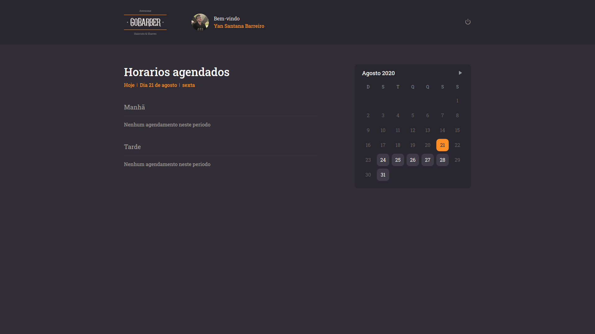
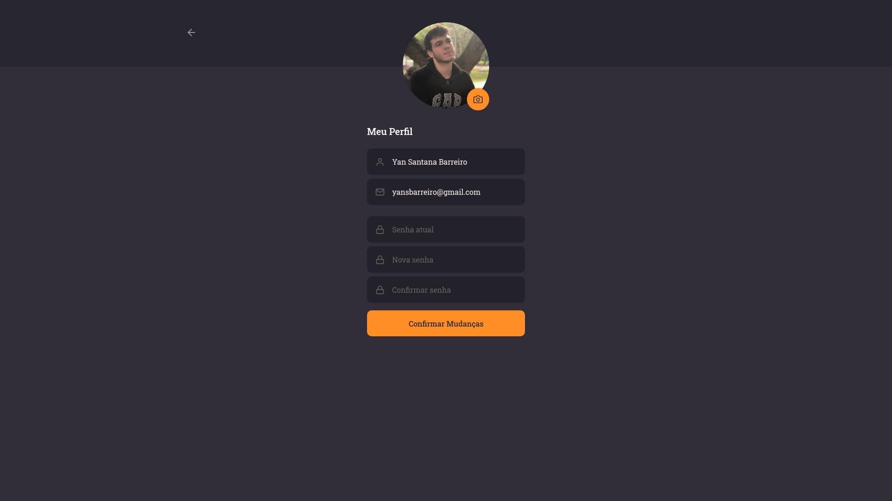

<h1 align="center">
    
    <br>
    GoBarber Web
</h1>

<h4 align="center">
  :warning: Se quiser testar a função de fazer login, é necessario baixar a API e rodar num banco postgress chamado "gostack_postgres" :warning:
</h4>

## :information_source: Como usar

Para rodar essa aplicação será necessario, [Git](https://git-scm.com), [nodejs](https://nodejs.org/en/)  + [yarn](https://yarnpkg.com/) ou mais recente e a [GoBarber API](https://github.com/Yansb/GoBarber)

```bash
# Clone o repositorio
$ git clone https://github.com/Yansb/GoBarber-web.git

# Entre nele
$ cd GoBarber-web

# Instale as dependencias
$ yarn

# Rode o app
$ yarn start
```




